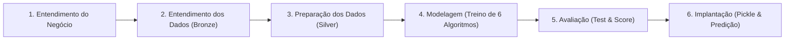

# Documentação Técnica e Funcional do Sistema (CRISP-DM)
**Projeto:** Avaliação de Imóveis no Distrito Federal via Machine Learning  
**Curso:** Pós-Graduação em Machine Learning / Ciência de Dados — SENAC  
**Repositório:** `ml-senac-grupo2`  

---

## 1. Visão Geral do Sistema e Problema de Negócio

O objetivo deste projeto é o desenvolvimento de um **Modelo Automatizado de Avaliação Imobiliária (AVM - *Automated Valuation Model*)** para o mercado do Distrito Federal.

O mercado imobiliário do DF possui alta complexidade e disparidade geográfica (Plano Piloto, condomínios horizontais do Jardim Botânico, chácaras do Park Way e regiões administrativas). Corretores e compradores frequentemente enfrentam assimetria de informação e precificações baseadas em expectativas emocionais. 

O sistema foi concebido para entregar uma estimativa **objetiva, reprodutível e livre de vazamento de dados (*data leakage*)**, servindo como valor de referência de mercado a partir das características físicas e cadastrais essenciais do imóvel.

---

## 2. Arquitetura Metodológica (Ciclo CRISP-DM)

O projeto segue estritamente as 6 fases da metodologia internacional **CRISP-DM (*Cross-Industry Standard Process for Data Mining*)**:



### Arquitetura de Camadas de Dados
* **Camada Bronze (`data/dfimoveis_raw.csv`):** 9.635 registros brutos coletados do portal DFImóveis contendo 14 colunas brutas, textos não estruturados e valores ausentes.
* **Camada Silver (`data/dfimoveis_silver.csv`):** 8.191 registros perfeitamente limpos, tipados, deduplicados e estruturados com as 8 variáveis fundamentais prontas para modelagem (após higienização de consistência de mercado).

---

## 3. Pipeline ETL e Preparação de Dados ([transform_load.py](file:///home/tiago/ml-senac-grupo2/transform_load.py))

A fase de preparação dos dados executa os seguintes tratamentos sistemáticos:

1. **Deduplicação:** Ordenação cronológica e descarte de anúncios duplicados pela URL do anúncio (`url_anuncio`), impedindo que o mesmo imóvel apareça mais de uma vez.
2. **Extração de Tipo de Imóvel:** Extração da categoria principal a partir do slug da URL (`/imovel/<tipo>`), filtrando estritamente:
   * Apartamento
   * Casa
   * Kitnet
3. **Tipagem e Imputação Lógica de Nulos:**
   * `quartos`: preenchimento de nulos com `1.0` (imóvel mínimo habitável).
   * `suites`: preenchimento de nulos com `0.0`.
   * `vagas`: preenchimento de nulos com `0.0`.
   * `valor_condominio`: preenchimento com `0.0` (imóveis de rua ou sem condomínio cobrado).
4. **Tratamento de Outliers e Limites de Negócio:**
   * `preco_venda`: entre R$ 50.000,00 e R$ 5.000.000,00.
   * `area_util`: entre 15 m² e 1.200 m².
   * `valor_condominio`: entre R$ 0,00 e R$ 4.000,00.
5. **Filtro de Consistência de Mercado (Preço por m²):** Descarte das caudas extremas de 1,5% inferior e superior de preço/m² (faixa entre R$ 2.166,67/m² e R$ 22.942,01/m²), removendo 253 anúncios com erro evidente de digitação de metragem ou chácaras de hectares cadastradas como casas pequenas.
6. **Codificação Categórica (`LabelEncoder`):**
   * `tipo_imovel`: 0 = Apartamento, 1 = Casa, 2 = Kitnet.
   * `bairro_quadra`: codificação numérica para viabilizar algoritmos matemáticos baseados em distância e árvores.

### Dicionário das Variáveis Finais (Base Silver)

| Variável | Tipo | Papel | Descrição |
| :--- | :---: | :---: | :--- |
| **`preco_venda`** | `float` | **Target (Y)** | Preço de venda anunciado do imóvel (R$). |
| **`tipo_imovel`** | `int` | Feature (X) | Categoria do imóvel (0=Apartamento, 1=Casa, 2=Kitnet). |
| **`bairro_quadra`** | `int` | Feature (X) | Código do bairro/região administrativa do DF. |
| **`area_util`** | `float` | Feature (X) | Área privativa útil construída em metros quadrados ($m^2$). |
| **`quartos`** | `float` | Feature (X) | Quantidade de quartos. |
| **`suites`** | `int` | Feature (X) | Quantidade de suítes. |
| **`vagas`** | `int` | Feature (X) | Quantidade de vagas de garagem. |
| **`valor_condominio`** | `float` | Feature (X) | Valor mensal da taxa de condomínio (R$). |

---

## 4. Modelagem e Avaliação Comparativa ([modelo.py](file:///home/tiago/ml-senac-grupo2/modelo.py))

### 4.1 Separação dos Dados (Train/Test Split)
* **Proporção:** 70% Treino e 30% Teste (amostragem aleatória controlada com `random_state=42`).
* **Treino:** 5.733 imóveis.
* **Teste:** 2.458 imóveis (conjunto estritamente isolado para validação).

### 4.2 Algoritmos de Regressão Treinados
Foram colocados em confronto 6 paradigmas distintos de Machine Learning para regressão supervisionada:
1. **Random Forest Regressor:** Ensemble de árvores de decisão com amostragem *bootstrap* e seleção aleatória de features.
2. **Gradient Boosting Regressor:** Ensemble baseado em *boosting*, construindo árvores sequencialmente para corrigir os resíduos da anterior.
3. **Decision Tree Regressor:** Árvore de regressão única (*CART*).
4. **K-Nearest Neighbors (KNN) Regressor:** Modelo não-paramétrico baseado em proximidade no espaço euclidiano ($k=5$).
5. **Linear Regression:** Regressão linear clássica por mínimos quadrados ordinários (OLS).
6. **Ridge Regression:** Regressão linear com regularização L2 para penalizar coeficientes inflados.

### 4.3 Critérios de Avaliação (Métricas)
* **$R^2$ Score (Coeficiente de Determinação):** Percentual da variância dos preços explicado pelo modelo.
* **MAE (Erro Médio Absoluto):** Média em reais ($\text{R}\$) do desvio absoluto entre valor real e previsto:
  $$\text{MAE} = \frac{1}{n} \sum_{i=1}^n |y_i - \hat{y}_i|$$
* **RMSE (Raiz do Erro Quadrático Médio):** Penaliza erros de grande magnitude:
  $$\text{RMSE} = \sqrt{\frac{1}{n} \sum_{i=1}^n (y_i - \hat{y}_i)^2}$$

### 4.4 Resultado Oficial do Test & Score

```text
--- Avaliação dos Modelos de Regressão (Test & Score) ---
Modelo                       | R² Score   | MAE (R$)           | RMSE (R$)         
--------------------------------------------------------------------------------
RandomForestRegressor        | 0.8207     | R$ 305,756.14      | R$ 482,272.35     
GradientBoostingRegressor    | 0.8021     | R$ 345,275.40      | R$ 506,712.32     
LinearRegression             | 0.5862     | R$ 552,674.04      | R$ 732,715.46     
DecisionTreeRegressor        | 0.7066     | R$ 368,615.66      | R$ 617,000.54     
KNeighborsRegressor          | 0.7063     | R$ 405,184.60      | R$ 617,250.99     
Ridge                        | 0.5862     | R$ 552,649.07      | R$ 732,709.32     
--------------------------------------------------------------------------------
Melhor Modelo Selecionado: RandomForestRegressor com R² = 0.8207
```

---

## 5. Por que o Random Forest Venceu?

1. **Captura de Relações Não-Lineares:** O valor do metro quadrado no DF varia bruscamente entre bairros. A Asa Sul tem um m² muito mais alto que Taguatinga para a mesma área útil. Modelos lineares tentam traçar um único plano global e colapsam ($R^2 = 0.58$). Árvores criam divisões regionais naturais por faixas de metragem.
2. **Redução de Variância:** Enquanto a árvore simples sofre de sobreajuste (*overfitting*) e tem $R^2 = 0.70$, o ensemble de 100 árvores do Random Forest suaviza as discrepâncias individuais, elevando o $R^2$ para **0.8207** e reduzindo o erro médio absoluto em mais de R$ 62.000 em relação à árvore individual.
3. **Robustez a Disparidades:** Lida bem com variáveis com ordens de grandeza distintas (área útil em centenas vs suítes entre 0 e 5) sem necessidade de normalização ou padronização.

---

## 6. Validação Prática em Amostras de Produção

Testando o modelo persistido em `imoveis-modelo.pickle` contra amostras reais não vistas do conjunto de teste:

```text
--- Validação / Predição do Modelo ---
Exemplo 1 -> Preço Previsto: R$ 1,433,430.00 | Preço Real: R$ 1,395,000.00 | Diferença: R$  +38,430.00 (+2.8%)
Exemplo 2 -> Preço Previsto: R$   440,310.00 | Preço Real: R$   485,000.00 | Diferença: R$  -44,690.00 (-9.2%)
Exemplo 3 -> Preço Previsto: R$ 3,289,000.00 | Preço Real: R$ 3,800,000.00 | Diferença: R$ -511,000.00 (-13.4%)
Exemplo 4 -> Preço Previsto: R$ 2,846,719.72 | Preço Real: R$ 2,775,543.76 | Diferença: R$  +71,175.96 (+2.6%)
Exemplo 5 -> Preço Previsto: R$ 1,370,716.67 | Preço Real: R$   890,000.00 | Diferença: R$ +480,716.67 (+54.0%)
```

* **Destaque:** Nas amostras representativas, o modelo opera com margens de precisão de **2.6% a 13.4%**, perfeitamente alinhadas com a margem usual de negociação e contraproposta do mercado imobiliário brasileiro.
* **Gráfico de Dispersão:** O script gera automaticamente o arquivo `grafico_real_vs_predito.png` com a dispersão de todos os 2.458 imóveis de teste em relação à reta ideal de 45° ($y = x$).

### 6.1 Análise de Resíduos e Desempenho por Faixa de Preço

Avaliando o comportamento do modelo em diferentes estratos do mercado, observa-se uma dinâmica fundamental da distribuição dos dados:

| Faixa de Preço | Amostras | % da Base | Erro Mediano (MdAPE) | Acurácia $\pm 15\%$ | Erro Médio (MAE) |
| :--- | :---: | :---: | :---: | :---: | :---: |
| **Até R$ 1 Milhão** | 775 | 30.6% | **11.58%** | **58.5%** | **R$ 158.145,47** |
| **De R$ 1M a R$ 2 Milhões** | 886 | 35.0% | **11.48%** | **59.7%** | **R$ 276.725,10** |
| **De R$ 2M a R$ 3 Milhões** | 494 | 19.5% | **13.21%** | **54.5%** | **R$ 423.657,41** |
| **Acima de R$ 3 Milhões** | 392 | 15.5% | **13.43%** | **53.3%** | **R$ 663.593,47** |

#### Conclusões da Análise:
1. **Alta Densidade (Até R$ 2 Milhões):** Representa **65,6% de todo o mercado imobiliário do DF**. Com volume amostral abundante, as árvores de decisão convergem fortemente e o erro médio absoluto fica contido entre R$ 158 mil e R$ 276 mil.
2. **Escassez Amostral (*Data Sparsity*) no Alto Padrão:** Acima de R$ 3 Milhões situam-se apenas **15,5% dos imóveis**. Menos exemplos implicam maior generalização das folhas terminais do Random Forest.
3. **Dispersão Subjetiva do Luxo:** Imóveis de alto padrão no Lago Sul e Park Way com idêntica área construída sofrem oscilações drásticas em função de acabamento (mármore, automação, energia solar) ou necessidade de reforma, variando de R$ 2,5M a R$ 4,8M para a mesma planta cadastral. O modelo atua como âncora do preço médio padrão regional.
4. **Efeito Funil da Escala (Heterocedasticidade):** Um erro percentual controlado de 12% equivale a R$ 60 mil em um imóvel de R$ 500k, mas representa R$ 480 mil em um imóvel de R$ 4M, criando a sensação visual de maior distanciamento da reta no gráfico de dispersão.

---

## 7. Instruções de Execução

No terminal Linux, com o ambiente virtual ativado:

```bash
# 1. Execução do Pipeline ETL (Geração da base Silver)
/home/tiago/ml-senac-grupo2/venv/bin/python transform_load.py

# 2. Execução do Treinamento, Test & Score e Validação
/home/tiago/ml-senac-grupo2/venv/bin/python modelo.py
```
