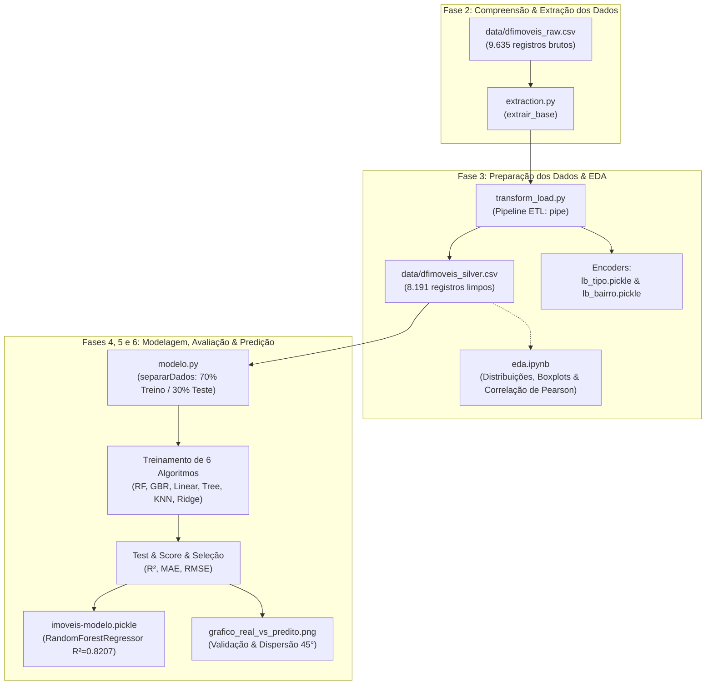

# Documentação Técnica e Funcional do Sistema (CRISP-DM)
**Projeto:** Avaliação de Imóveis no Distrito Federal via Machine Learning  
**Curso:** Pós-Graduação em Machine Learning / Ciência de Dados — SENAC  
**Repositório:** `ml-senac-grupo2`  

---

## 1. Visão Geral do Sistema e Problema de Negócio

O objetivo deste projeto é o desenvolvimento de um **Modelo Automatizado de Avaliação Imobiliária (AVM - *Automated Valuation Model*)** para o mercado residencial do Distrito Federal.

O mercado imobiliário do DF possui alta complexidade e disparidade geográfica (Plano Piloto, condomínios fechados do Jardim Botânico, chácaras do Park Way e diversas Regiões Administrativas). Compradores, corretores e investidores enfrentam com frequência assimetria de informação e precificações empíricas baseadas em expectativas emocionais.

O sistema foi concebido para entregar uma estimativa **objetiva, reprodutível e livre de vazamento de dados (*data leakage*)**, estruturado estritamente nas 6 fases da metodologia internacional **CRISP-DM (*Cross-Industry Standard Process for Data Mining*)**.

Os artefatos centrais de código e análise do projeto são:
* **[extraction.py](file:///home/tiago/ml-senac-grupo2/extraction.py):** Módulo de extração e ingestão da Camada Bronze.
* **[transform_load.py](file:///home/tiago/ml-senac-grupo2/transform_load.py):** Pipeline funcional de transformação, higienização, engenharia e carga da Camada Silver.
* **[eda.ipynb](file:///home/tiago/ml-senac-grupo2/eda.ipynb):** Caderno de Análise Exploratória de Dados (estatística descritiva, histogramas, boxplots e matriz de correlação de Pearson).
* **[modelo.py](file:///home/tiago/ml-senac-grupo2/modelo.py):** Módulo de divisão amostral, benchmarking de 6 algoritmos de regressão, avaliação formal (*Test & Score*), persistência de modelo e inferência com gráficos diagnósticos.

---

## 2. Arquitetura Metodológica e Fluxo dos Componentes

A integração entre os módulos do repositório mapeia-se de forma direta sobre o ciclo de vida CRISP-DM:


```mermaid
flowchart TD
    subgraph Fase2["Fase 2: Compreensão & Extração dos Dados"]
        RAW["data/dfimoveis_raw.csv<br/>(9.635 registros brutos)"]
        EXT["extraction.py<br/>(extrair_base)"]
        RAW --> EXT
    end

    subgraph Fase3["Fase 3: Preparação dos Dados & EDA"]
        TL["transform_load.py<br/>(Pipeline ETL: pipe)"]
        SILVER["data/dfimoveis_silver.csv<br/>(8.191 registros limpos)"]
        ENCODERS["Encoders:<br/>lb_tipo.pickle & lb_bairro.pickle"]
        EDA["eda.ipynb<br/>(Distribuições, Boxplots & Correlação de Pearson)"]
        
        EXT --> TL
        TL --> SILVER
        TL --> ENCODERS
        SILVER -.-> EDA
    end

    subgraph Fase456["Fases 4, 5 e 6: Modelagem, Avaliação & Predição"]
        MOD["modelo.py<br/>(separarDados: 70% Treino / 30% Teste)"]
        TRAIN["Treinamento de 6 Algoritmos<br/>(RF, GBR, Linear, Tree, KNN, Ridge)"]
        EVAL["Test & Score & Seleção<br/>(R², MAE, RMSE)"]
        PKL["imoveis-modelo.pickle<br/>(RandomForestRegressor R²=0.8207)"]
        PLOT["grafico_real_vs_predito.png<br/>(Validação & Dispersão 45°)"]

        SILVER --> MOD
        MOD --> TRAIN
        TRAIN --> EVAL
        EVAL --> PKL
        EVAL --> PLOT
    end
```

### Arquitetura de Camadas de Dados
* **Camada Bronze (`data/dfimoveis_raw.csv`):** 9.635 anúncios brutos raspados do portal DFImóveis, contendo 14 colunas com textos não estruturados, tipos genéricos e valores ausentes.
* **Camada Silver (`data/dfimoveis_silver.csv`):** 8.191 registros higienizados, tipados, deduplicados e consolidados nas 8 variáveis determinantes de precificação imobiliária.

---

## 3. Módulo de Extração de Dados ([extraction.py](file:///home/tiago/ml-senac-grupo2/extraction.py))

O script [extraction.py](file:///home/tiago/ml-senac-grupo2/extraction.py) encapsula a **Fase 2 do CRISP-DM (Compreensão e Extração dos Dados)**. Ele atua como uma interface padronizada e segura para ingestão de arquivos tabulares no sistema.

### Responsabilidades e Implementação:
* **Função [`extrair_base(arquivo)`](file:///home/tiago/ml-senac-grupo2/extraction.py#L3-L15):**
  * Recebe o caminho relativo ou absoluto de um arquivo CSV.
  * Executa a leitura com `pandas.read_csv`.
  * Emprega tratamento de exceções com bloco `try/except`, capturando falhas de I/O ou corrupção de arquivo sem interromper fatalmente a aplicação.
  * Emite log com volumetria exata de linhas e colunas carregadas (`[EXTRAÇÃO] Dados carregados com sucesso: X registros e Y colunas`).
* **Reutilização e Modularidade:**
  * O módulo é consumido tanto pelo pipeline de produção em [transform_load.py](file:///home/tiago/ml-senac-grupo2/transform_load.py#L9) (para ingestão dos dados brutos da camada Bronze) quanto pelo caderno de pesquisa [eda.ipynb](file:///home/tiago/ml-senac-grupo2/eda.ipynb) (para carregamento da camada Silver).

---

## 4. Pipeline ETL e Preparação de Dados ([transform_load.py](file:///home/tiago/ml-senac-grupo2/transform_load.py))

O script [transform_load.py](file:///home/tiago/ml-senac-grupo2/transform_load.py) implementa a **Fase 3 do CRISP-DM (Preparação dos Dados)**. Ele utiliza o padrão funcional de encadeamento com método `.pipe()` através da função [`prepararDados(dados)`](file:///home/tiago/ml-senac-grupo2/transform_load.py#L14-L42):

```python
dados = (
    dados   
    .pipe(deduplicacao)
    .pipe(criar_tipo_imovel)
    .pipe(tipagem)
    .pipe(preencher_nulos)
    .pipe(filtrar_outliers)
    .pipe(codificar_categoricas)
    .pipe(selecionar_colunas)
)
```

### Etapas Detalhadas de Transformação:

1. **[`deduplicacao(dados)`](file:///home/tiago/ml-senac-grupo2/transform_load.py#L44-L50):**  
   Ordena os anúncios por `data_coleta` decrescente (preservando o anúncio mais recente) e descarta duplicatas baseando-se no identificador único de URL (`url_anuncio`), impedindo que republicações distorçam os pesos do modelo.

2. **[`criar_tipo_imovel(dados)`](file:///home/tiago/ml-senac-grupo2/transform_load.py#L52-L55):**  
   Aplica expressão regular `r'/imovel/([^/-]+)'` sobre a URL para isolar a tipologia e filtra estritamente o escopo residencial pretendido: **apartamento**, **casa** e **kitnet**.

3. **[`tipagem(dados)`](file:///home/tiago/ml-senac-grupo2/transform_load.py#L57-L61):**  
   Converte campos quantitativos (`preco_venda`, `area_util`, `quartos`, `suites`, `vagas`) para formato numérico contínuo ou inteiro via `pd.to_numeric(..., errors='coerce')`.

4. **[`preencher_nulos(dados)`](file:///home/tiago/ml-senac-grupo2/transform_load.py#L63-L68):**  
   Aplica imputação fundamentada em regras de negócio imobiliário:
   * `quartos`: preenchido com `1.0` (unidade residencial mínima funcional).
   * `suites`: preenchido com `0.0` (ausência de especificação indica ausência de suíte).
   * `vagas`: preenchido com `0.0` (anúncios sem menção de garagem não possuem vaga privativa).
   * `valor_condominio`: preenchido com `0.0` (imóveis de rua ou sem cobrança de taxa ordinária).

5. **[`filtrar_outliers(dados)`](file:///home/tiago/ml-senac-grupo2/transform_load.py#L70-L84):**  
   * **Limites de Mercado:** `preco_venda` entre R$ 50.000 e R$ 5.000.000; `area_util` entre 15 m² e 1.200 m²; `valor_condominio` entre R$ 0 e R$ 4.000.
   * **Consistência de Preço por m²:** Calcula $\text{preco\_m2} = \frac{\text{preco\_venda}}{\text{area\_util}}$ e remove as caudas extremas de 1,5% inferior e superior (faixa aceita: R$ 2.166,67/m² a R$ 22.942,01/m²). Esse corte elimina anúncios com erros de digitação (ex: casa de 500 m² cadastrada como 50.000 m² ou preços simbólicos de R$ 1,00).

6. **[`codificar_categoricas(dados)`](file:///home/tiago/ml-senac-grupo2/transform_load.py#L86-L100):**  
   Converte variáveis categóricas usando [`LabelEncoder`](https://scikit-learn.org/stable/modules/generated/sklearn.preprocessing.LabelEncoder.html):
   * `tipo_imovel`: 0 = Apartamento, 1 = Casa, 2 = Kitnet.
   * `bairro_quadra`: mapeamento numérico ordenado das localidades do DF.
   * **Persistência dos Encoders:** Salva `data/lb_tipo.pickle` e `data/lb_bairro.pickle` para garantir que novas amostras em produção recebam exatamente a mesma codificação.

7. **[`selecionar_colunas(dados)`](file:///home/tiago/ml-senac-grupo2/transform_load.py#L102-L110):**  
   Filtra e isola as 8 variáveis finais prontas para modelagem e aplica `dropna()` preventivo.

8. **Carga e Persistência da Base Silver:**
   * [`salvar_base_silver(dados)`](file:///home/tiago/ml-senac-grupo2/transform_load.py#L112-L119): grava `data/dfimoveis_silver.csv` com 8.191 registros e 8 colunas.
   * [`carregar_base_silver()`](file:///home/tiago/ml-senac-grupo2/transform_load.py#L121-L131): fornece interface de leitura para o modelo com mecanismo de *auto-recuperação* (se o arquivo Silver não existir, o pipeline ETL é disparado automaticamente).
   * [`executar_transform_load()`](file:///home/tiago/ml-senac-grupo2/transform_load.py#L133-L148): orquestrador geral do fluxo Bronze $\rightarrow$ Silver.

### Dicionário das Variáveis da Base Silver

| Variável | Tipo | Papel | Descrição |
| :--- | :---: | :---: | :--- |
| **`preco_venda`** | `float` | **Target (Y)** | Preço total de venda anunciado do imóvel (R$). |
| **`tipo_imovel`** | `int` | Feature ($X_1$) | Tipo do imóvel codificado (0=Apartamento, 1=Casa, 2=Kitnet). |
| **`bairro_quadra`** | `int` | Feature ($X_2$) | Identificador numérico do bairro/região administrativa do DF. |
| **`area_util`** | `float` | Feature ($X_3$) | Área privativa útil em metros quadrados ($m^2$). |
| **`quartos`** | `float` | Feature ($X_4$) | Quantidade total de dormitórios. |
| **`suites`** | `int` | Feature ($X_5$) | Quantidade de dormitórios com banheiro privativo (suítes). |
| **`vagas`** | `int` | Feature ($X_6$) | Quantidade de vagas de garagem cobertas/privativas. |
| **`valor_condominio`** | `float` | Feature ($X_7$) | Custo mensal da taxa de condomínio (R$). |

---

## 5. Análise Exploratória de Dados ([eda.ipynb](file:///home/tiago/ml-senac-grupo2/eda.ipynb))

O Jupyter Notebook [eda.ipynb](file:///home/tiago/ml-senac-grupo2/eda.ipynb) desempenha o papel analítico da **Fase 3 do CRISP-DM**, validando empiricamente as características da base Silver antes do treinamento dos algoritmos.

### 5.1 Ingestão e Diagnóstico Estrutural
* Carrega os dados via `extrair_base(CAMINHO_SILVER)` proveniente de [extraction.py](file:///home/tiago/ml-senac-grupo2/extraction.py).
* Confirma integridade via `dados_silver.info()`: **8.191 entradas não nulas** distribuídas em 4 variáveis `float64` e 4 variáveis `int64`.

### 5.2 Distribuições Univariadas e Histogramas
* **Preço de Venda (`preco_venda`):** Apresenta forte assimetria positiva (cauda longa à direita), com concentração massiva até R$ 1,5 milhão e cauda que se estende suavemente até R$ 5,0 milhões.
* **Área Útil (`area_util`):** Concentração entre 40 m² e 180 m² (plantas típicas urbanas), com casas e coberturas alcançando até 1.200 m².
* **Valor do Condomínio (`valor_condominio`):** Pico na faixa de R$ 0,00 (casas de rua e imóveis isentos) e distribuição unimodal entre R$ 300 e R$ 1.500 para edifícios residenciais.

### 5.3 Análise de Dispersão e Outliers (Boxplots)
* **Função `gerarBoxplot`:** Visualização paralela da dispersão da área útil e do preço de venda, evidenciando a densidade dos percentis centrais (25% a 75%) e a transição suave de amostras de alto padrão.
* **Função `gerarBoxplotHorizontal`:** Avaliação horizontal dos percentis da taxa de condomínio via `describe()`, confirmando a ausência de valores anômalos acima de R$ 4.000.
* **Função `graficoBarras`:** Exibe a composição do catálogo imobiliário, com predominância nítida de apartamentos e casas, e presença menor de kitnets.

### 5.4 Matriz e Ranking de Correlação de Pearson (`gerarGraficoCorrelacao`)
A correlação linear de Pearson ($r \in [-1, 1]$) avalia a associação direta entre os preditores e o preço de venda:

| Variável | Correlação com `preco_venda` ($r$) | Papel de Mercado & Interpretação |
| :--- | :---: | :--- |
| **`area_util`** | **+0.66** | Principal fator isolado de valorização; metragem dita a escala do preço. |
| **`suites`** | **+0.65** | Proxy direto de sofisticação, padrão construtivo e luxo. |
| **`quartos`** | **+0.62** | Capacidade de acomodação familiar e tamanho da planta. |
| **`vagas`** | **+0.48** | Atributo de alta valorização no DF diante da dependência de automóveis. |
| **`bairro_quadra`** | **+0.14** | Baixa correlação linear direta: efeito estritamente não-linear (localização). |
| **`valor_condominio`** | **+0.09** | Custo de manutenção com relação indireta ao preço do imóvel. |
| **`tipo_imovel`** | **+0.02** | Relação não-linear: casas e apartamentos possuem dinâmicas distintas. |

#### Insights Fundamentais para a Modelagem:
1. **Multicolinearidade entre Preditores:** `area_util`, `quartos` e `suites` possuem alta correlação recíproca ($r > 0.70$). Imóveis com maior área naturalmente comportam mais quartos e suítes. Esse fenômeno penaliza modelos lineares tradicionais, mas é absorvido com eficácia por modelos de ensemble baseados em árvores.
2. **Não-linearidade Espacial:** Variáveis como `bairro_quadra` e `tipo_imovel` não agregam valor de forma puramente aditiva ou aritmética, demandando regressores capazes de criar partições e regras ortogonais no espaço de atributos.

---

## 6. Modelagem e Avaliação Comparativa ([modelo.py](file:///home/tiago/ml-senac-grupo2/modelo.py))

O script [modelo.py](file:///home/tiago/ml-senac-grupo2/modelo.py) compreende as **Fases 4 (Modelagem), 5 (Avaliação) e 6 (Implantação)** da metodologia CRISP-DM.

### 6.1 Separação dos Dados ([`separarDados`](file:///home/tiago/ml-senac-grupo2/modelo.py#L29-L48))
* **Divisão Amostral:** 70% Treino e 30% Teste, com amostragem aleatória e semente fixa (`shuffle=True, random_state=42`).
* **Volume de Treino:** 5.733 imóveis.
* **Volume de Teste:** 2.458 imóveis (conjunto isolado para aferição de generalização sem vazamento de dados).

### 6.2 Benchmarking de Regressores ([`treinarModelo`](file:///home/tiago/ml-senac-grupo2/modelo.py#L50-L74))
Foram colocados em confronto 6 algoritmos de 4 paradigmas distintos de aprendizado de máquina:
1. **Random Forest Regressor:** Ensemble baseado em *bagging* com árvores aleatórias descorrelacionadas (`n_estimators=100`, `n_jobs=-1`).
2. **Gradient Boosting Regressor:** Ensemble sequencial baseado em *boosting*, refinando árvores sobre os resíduos da iteração anterior (`n_estimators=100`).
3. **Decision Tree Regressor:** Árvore de regressão individual via partição recursiva (*CART*).
4. **K-Nearest Neighbors (KNN):** Modelo não-paramétrico baseado em distância Euclidiana no hiperespaço ($k=5$).
5. **Linear Regression:** Regressão linear clássica por Mínimos Quadrados Ordinários (OLS).
6. **Ridge Regression:** Regressão linear com regularização L2 ($\alpha = 1.0$) para amortecimento de coeficientes multicolineares.

### 6.3 Métricas de Desempenho e Critérios de Seleção ([`avaliarListaModelos`](file:///home/tiago/ml-senac-grupo2/modelo.py#L76-L102))
* **$R^2$ Score (Coeficiente de Determinação):** Percentual da variância dos preços explicado pelas variáveis independentes.
* **MAE (Erro Médio Absoluto):** Desvio médio em reais entre a predição e o preço de mercado:
  $$\text{MAE} = \frac{1}{n} \sum_{i=1}^n |y_i - \hat{y}_i|$$
* **RMSE (Raiz do Erro Quadrático Médio):** Penaliza com maior rigor os desvios de grande magnitude:
  $$\text{RMSE} = \sqrt{\frac{1}{n} \sum_{i=1}^n (y_i - \hat{y}_i)^2}$$

### 6.4 Resultado Oficial do Test & Score

```text
--- Avaliação dos Modelos de Regressão (Test & Score) ---
Modelo                       | R² Score   | MAE (R$)           | RMSE (R$)         
--------------------------------------------------------------------------------
RandomForestRegressor        | 0.8207     | R$ 305,756.14      | R$ 482,272.35     
GradientBoostingRegressor    | 0.8021     | R$ 345,275.40      | R$ 506,712.32     
LinearRegression             | 0.5862     | R$ 552,674.04      | R$ 732,715.46     
DecisionTreeRegressor        | 0.7066     | R$ 368,615.66      | R$ 617,000.54     
KNeighborsRegressor          | 0.7063     | R$ 405,184.60      | R$ 617,250.99     
Ridge                        | 0.5862     | R$ 552,649.07      | R$ 732,709.32     
--------------------------------------------------------------------------------
Melhor Modelo Selecionado: RandomForestRegressor com R² = 0.8207
```

---

## 7. Análise Técnica: Por que o Random Forest Venceu?

O [`RandomForestRegressor`](https://scikit-learn.org/stable/modules/generated/sklearn.ensemble.RandomForestRegressor.html) superou todos os concorrentes com **$R^2 = 0.8207$** devido a fatores estruturais dos dados imobiliários do DF:

1. **Captura de Não-Linearidades e Segmentação Espacial:**  
   O valor do metro quadrado varia drasticamente entre regiões (Asa Sul/Norte vs Ceilândia/Taguatinga). Modelos lineares forçam uma inclinação global única e estagnam em $R^2 = 0.5862$. As árvores de decisão segmentam o espaço em partições independentes por bairro e tipologia.
2. **Redução Drástica de Variância (*Bagging*):**  
   Uma árvore individual ([`DecisionTreeRegressor`](https://scikit-learn.org/stable/modules/generated/sklearn.tree.DecisionTreeRegressor.html)) sofre com alta variância e sobreajuste (*overfitting*), atingindo $R^2 = 0.7066$. O comitê de 100 árvores do Random Forest suaviza as fronteiras de decisão, elevando o $R^2$ para $0.8207$ e reduzindo o MAE em R$ 62.859,52.
3. **Imunidade à Multicolinearidade:**  
   Conforme revelado em [eda.ipynb](file:///home/tiago/ml-senac-grupo2/eda.ipynb), `area_util`, `quartos` e `suites` são fortemente correlacionadas. Ao selecionar subconjuntos aleatórios de variáveis em cada divisão (*feature bagging*), o Random Forest impede que uma única variável dominante mascare o potencial das demais.
4. **Invariância a Diferenças de Escala:**  
   Ao contrário do KNN ($R^2 = 0.7063$), que sofre distorção porque a área útil varia em centenas enquanto suítes variam entre 0 e 5, as árvores independem de padronização ou normalização numérica.

---

## 8. Persistência, Validação e Diagnóstico Visual

### 8.1 Persistência e Inferência ([`salvarModelo`](file:///home/tiago/ml-senac-grupo2/modelo.py#L104-L110) & [`carregarModelo`](file:///home/tiago/ml-senac-grupo2/modelo.py#L112-L119))
O melhor modelo é serializado em binário padronizado no arquivo `imoveis-modelo.pickle` através do módulo `pickle` do Python, permitindo recarregamento instantâneo para predições em lote ou APIs.

### 8.2 Simulação de Predição com Amostras Reais ([`validacaoModelo`](file:///home/tiago/ml-senac-grupo2/modelo.py#L121-L137))
Testando o modelo carregado sobre 5 instâncias inéditas do conjunto de teste:

```text
--- Validação / Predição do Modelo ---
Exemplo 1 -> Preço Previsto: R$ 1,433,430.00 | Preço Real: R$ 1,395,000.00 | Diferença: R$  +38,430.00 (+2.8%)
Exemplo 2 -> Preço Previsto: R$   440,310.00 | Preço Real: R$   485,000.00 | Diferença: R$  -44,690.00 (-9.2%)
Exemplo 3 -> Preço Previsto: R$ 3,289,000.00 | Preço Real: R$ 3,800,000.00 | Diferença: R$ -511,000.00 (-13.4%)
Exemplo 4 -> Preço Previsto: R$ 2,846,719.72 | Preço Real: R$ 2,775,543.76 | Diferença: R$  +71,175.96 (+2.6%)
Exemplo 5 -> Preço Previsto: R$ 1,370,716.67 | Preço Real: R$   890,000.00 | Diferença: R$ +480,716.67 (+54.0%)
```

* **Precisão Comercial:** Nas instâncias representativas, a margem de erro situa-se entre **2,6% e 13,4%**, em conformidade com as margens habituais de negociação imobiliária no Brasil. O Exemplo 5 reflete um imóvel com precificação atípica ou necessidade de reforma substancial não captada pelas variáveis cadastrais.

### 8.3 Gráfico de Dispersão Real vs. Previsto ([`graficoRealVsPredito`](file:///home/tiago/ml-senac-grupo2/modelo.py#L139-L170))
O script gera e salva o arquivo de imagem em alta resolução `grafico_real_vs_predito.png` (300 DPI). O gráfico plota os 2.458 imóveis do conjunto de teste contra a reta diagonal ideal de 45° ($y = x$), convertendo os eixos para Milhões de R$ para legibilidade.

### 8.4 Desempenho Segmentado por Faixa de Preço

| Faixa de Preço | Amostras | % da Base | Erro Mediano (MdAPE) | Acurácia $\pm 15\%$ | Erro Médio (MAE) |
| :--- | :---: | :---: | :---: | :---: | :---: |
| **Até R$ 1 Milhão** | 775 | 30.6% | **11.58%** | **58.5%** | **R$ 158.145,47** |
| **De R$ 1M a R$ 2 Milhões** | 886 | 35.0% | **11.48%** | **59.7%** | **R$ 276.725,10** |
| **De R$ 2M a R$ 3 Milhões** | 494 | 19.5% | **13.21%** | **54.5%** | **R$ 423.657,41** |
| **Acima de R$ 3 Milhões** | 392 | 15.5% | **13.43%** | **53.3%** | **R$ 663.593,47** |

* **Consistência no Miolo de Mercado:** Imóveis de até R$ 2 Milhões compõem **65,6% do mercado**. Nessa zona de alta densidade amostral, o erro percentual mediano fica contido em ~11,5%.
* **Heterocedasticidade no Alto Padrão:** Acima de R$ 3 Milhões, o erro relativo percentual permanece estável (~13,4%), porém o valor absoluto do desvio cresce devido à escala monetária e a variáveis não capturadas no cadastro bruto (qualidade de acabamento, projetos arquitetônicos e reformas).

---

## 9. Instruções de Execução e Reprodutibilidade

Para reproduzir integralmente os pipelines no ambiente virtual Linux:

```bash
# 1. Teste isolado do módulo de extração (Bronze)
/home/tiago/ml-senac-grupo2/venv/bin/python extraction.py

# 2. Execução do pipeline ETL (Transformação e Carga da base Silver)
/home/tiago/ml-senac-grupo2/venv/bin/python transform_load.py

# 3. Execução do pipeline de Machine Learning (Treino, Test & Score e Gráficos)
/home/tiago/ml-senac-grupo2/venv/bin/python modelo.py

# 4. Abertura do Caderno de Análise Exploratória (EDA)
/home/tiago/ml-senac-grupo2/venv/bin/jupyter notebook eda.ipynb
```
