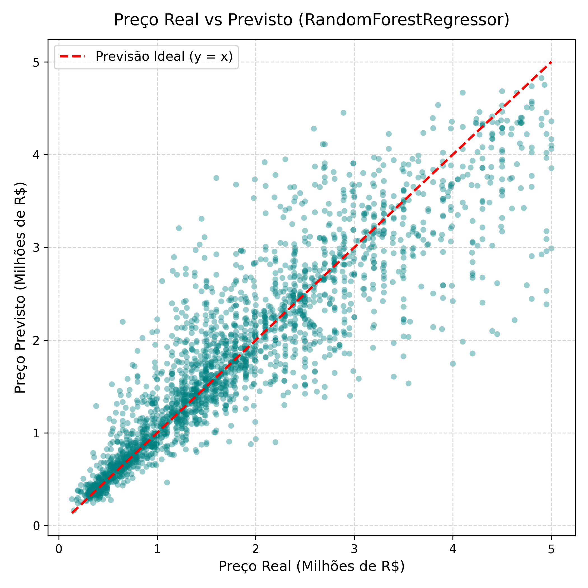
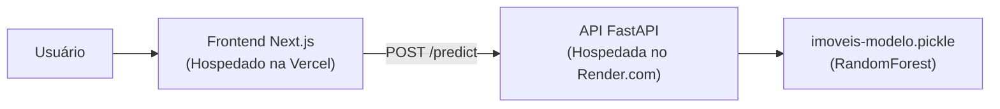

# Previsão de Preço de Imóveis no Distrito Federal (DF)

Projeto de Machine Learning desenvolvido para a Pós-Graduação de Data Science e IA no **SENAC**, com pipeline completo baseado na metodologia **CRISP-DM**: desde o web scraping de dados imobiliários até a disponibilização em produção via **API REST (FastAPI)** e interface web interativa em **React / Next.js com TypeScript**.

---

## Resumo do Projeto

O objetivo principal é prever o preço de venda de imóveis residenciais (apartamentos, casas e kitnets) em Brasília e cidades satélites do Distrito Federal com base em suas características estruturais e localização.

### Fases CRISP-DM:
1. **Compreensão do Negócio e Coleta (Fases 1 e 2):** Web scraping automatizado no portal DF Imóveis (`scrapper-dfimoveis`), gerando a base bruta (Camada Bronze).
2. **Preparação dos Dados / ETL (Fase 3):** Tratamento, deduplicação, remoção de outliers de m² inconsistentes, imputação de nulos e codificação categórica (`transform_load.py`), gerando a Camada Silver (`data/dfimoveis_silver.csv`) com **8.191 imóveis tratados**.
3. **Modelagem (Fase 4):** Comparação de múltiplos algoritmos de regressão supervisionada (`RandomForestRegressor`, `GradientBoostingRegressor`, `LinearRegression`, `Ridge`, `DecisionTreeRegressor`, `KNeighborsRegressor`).
4. **Avaliação (Fase 5):** Validação dos modelos com separação de 70% treino e 30% teste com métricas $R^2$, MAE e RMSE (`modelo.py`).
5. **Implantação / Deploy (Fase 6):** Disponibilização do modelo serializado (`imoveis-modelo.pickle`) via API REST em FastAPI e frontend web responsivo.

---

## Resultado do Modelo

O algoritmo campeão nos testes de regressão foi o **RandomForestRegressor**:

| Métrica | Resultado | Descrição |
| :--- | :--- | :--- |
| **Algoritmo** | **RandomForestRegressor** | 100 árvores de decisão (`n_estimators=100`, `random_state=42`) |
| **R² Score** | **0.8207** | O modelo explica **82.1% da variância** dos preços de venda |
| **MAE (Erro Médio Absoluto)** | **R$ 305.756,14** | Desvio médio em valor monetário |
| **RMSE (Raiz do Erro Quadrático Médio)** | **R$ 482.272,35** | Penalização de erros extremos |
| **Amostras de Treino / Teste** | **70% / 30%** | Avaliado em 2.458 amostras de teste |

### Gráfico Real vs. Predito:
O gráfico de dispersão compara os preços reais com os previstos em relação à linha ideal ($y = x$):



### Links da Aplicação em Produção:
- **Frontend Web (Vercel):** [*Acesse a aplicação no link do deploy da Vercel*](https://ml-senac-grupo2.vercel.app/)
- **API REST / Swagger (Render):** [*Acesse `/docs` na URL do seu Web Service no Render*](https://ml-senac-grupo2.onrender.com/docs)

---

## Como Rodar Localmente

### Pré-requisitos:
- Python 3.12+
- Node.js 18+ e npm

---

### 1. Backend (API FastAPI)

Na raiz do repositório:

```bash
# 1. Crie e ative o ambiente virtual
python3 -m venv venv
source venv/bin/activate   # No Windows: venv\Scripts\activate

# 2. Instale as dependências da API e do modelo
pip install -r api/requirements.txt

# 3. Inicie o servidor FastAPI
uvicorn api.main:app --reload --port 8000
```

- A documentação interativa Swagger estará acessível em: [http://localhost:8000/docs](http://localhost:8000/docs)
- Endpoint de opções: `GET http://localhost:8000/options`
- Endpoint de predição: `POST http://localhost:8000/predict`

#### Rodar os testes automatizados da API:
```bash
pytest api/test_api.py -v
```

---

### 2. Frontend (Next.js + TypeScript)

Em outro terminal, a partir da pasta `frontend/`:

```bash
cd frontend

# 1. Configure a variável de ambiente apontando para a API local
cp .env.example .env.local

# 2. Instale as dependências
npm install

# 3. Inicie o servidor de desenvolvimento
npm run dev
```

- Acesse a interface no navegador em: [http://localhost:3000](http://localhost:3000)

---

## Como Fazer Deploy em Produção

A arquitetura do projeto separa o **Backend (Python / Machine Learning)** e o **Frontend (Next.js / TypeScript)** nas plataformas onde cada um performa melhor:



---

### 1. Deploy da API no Render.com (Plano Free)

O Render hospeda a API em Python e executa o modelo de ML gratuitamente:

1. Acesse [render.com](https://render.com) e faça login com sua conta do **GitHub**.
2. Clique em **New +** > **Web Service**.
3. Selecione o repositório `ml-senac-grupo2`.
4. O Render detectará automaticamente o arquivo [`render.yaml`](render.yaml). Se configurar manualmente:
   - **Environment**: `Python 3`
   - **Build Command**: `pip install -r api/requirements.txt`
   - **Start Command**: `uvicorn api.main:app --host 0.0.0.0 --port $PORT`
   - **Instance Type**: `Free`
   - **Environment Variables**: Adicione `PYTHON_VERSION = 3.12.3`
5. Clique em **Create Web Service**.
6. Ao finalizar o deploy, copie a URL gerada (exemplo: `https://api-predicao-imoveis.onrender.com`).

> [!NOTE]
> No plano gratuito do Render, a instância entra em modo de hibernação após 15 minutos de inatividade. O primeiro acesso pode levar entre 30 a 50 segundos para inicializar. A interface do frontend possui um botão de reconexão automática caso isso ocorra.

---

### 2. Deploy do Frontend na Vercel

1. Acesse [vercel.com](https://vercel.com) e clique em **Add New Project**.
2. Importe o repositório `ml-senac-grupo2`.
3. Na tela de configuração:
   - **Root Directory**: Clique em *Edit* e selecione a pasta **`frontend`**.
   - **Environment Variables**:
     - **Key**: `NEXT_PUBLIC_API_URL`
     - **Value**: Cole a URL da API gerada pelo Render *(ex: `https://api-predicao-imoveis.onrender.com`, sem barra `/` no final)*.
     - ⚠️ Certifique-se de marcar todos os ambientes: **Production**, **Preview** e **Development**.
4. Clique em **Deploy**.

---

## Equipe
Projeto desenvolvido pelo **Grupo 2** para a disciplina de Machine Learning no SENAC.